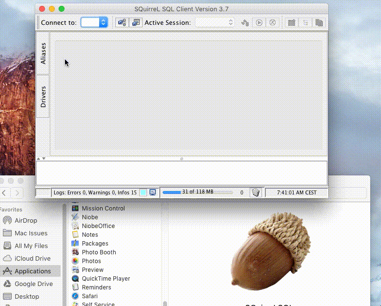

.. only:: html

    .. sidebar:: Article information

        :Authors: 
            :ref:`ftiff <team-ftiff>`
        
        :Updated: |today|

SQL Clients
===========

IBMi DB2 Databases
------------------

You could use the IBM System i Navigator, but how about a tool you can use on all DB (PostgreSQL, MySQL, SQL Server, DB2…). I must warn you: it's Java from the nineties. 

Components needed
^^^^^^^^^^^^^^^^^

- `Java 1.8 JDK <http://www.oracle.com/technetwork/java/javase/downloads/jdk8-downloads-2133151.html>`_
- `JTOpen <http://jt400.sourceforge.net/>`_
- `SQuirrel <http://www.squirrelsql.org/#installation>`_

JTOpen
"""""""""

The IBM Toolbox for Java is a library of Java classes supporting the client/server and internet programming models to a system running IBM i (or i5/OS or OS/400). The classes are used by SQuirreL to easily access IBM i data and resources.

1. Download and install `Java 1.8 JDK <http://www.oracle.com/technetwork/java/javase/downloads/jdk8-downloads-2133151.html>`_
2. Download `JTOpen <http://jt400.sourceforge.net/>`_ 
3. Copy lib/ where you'd like. I believe the right path is '/usr/local/lib/jtopen/'::

    ``sudo ditto ~/Downloads/jtopen_9_0/lib /usr/local/lib/jtopen_9_0``

SQuirreL
""""""""""""

1. Download `SQuirrel <http://www.squirrelsql.org/#installation>>`_
2. Open squirrel-sql-3.7-MACOSX-install.jar
3. Make sure you select "Optional Plugin - DB2"
4. Click on Drivers > JTOpen(AS/400)
5. Click on Extra Class Path
6. Click Add, then choose /usr/local/lib/jtopen_9_0/java8/jt400.jar and click OK. 
7. You should get a green message "Driver class com.ibm.as400.access.AS400JDBCDriver successfully registered for driver definition: JTOpen(AS/400)"
8. Click on Aliases > + (blue cross)
9. Select Driver: JTOpen(AS/400) (it should have a blue check mark)
10. Enter your info, click OK. It should now be working!

`More info… <http://www.mcpressonline.com/programming/sql/an-open-source-db2-sql-graphical-tool-that-you-can-use-for-all-your-databases.html>`_
