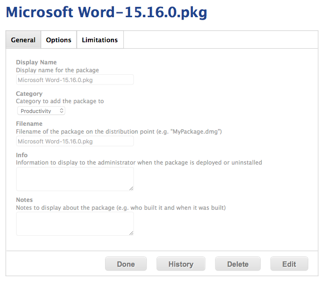
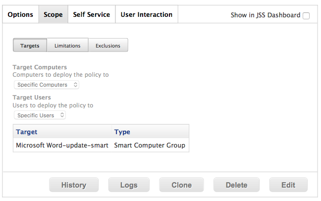

## Make an Override
```bash
$ autopkg make-override com.github.jss-recipes.jss.MicrosoftWord
Override file saved to /Users/admin/Library/AutoPkg/RecipeOverrides/Microsoft Word.jss.recipe
$ mv ~/Library/AutoPkg/RecipeOverrides/Microsoft\ Word.jss.recipe ~/Library/AutoPkg/RecipeRepos/com.github.ftiff.mac-autopkg/MicrosoftOffice2016/
$ cd ~/Library/AutoPkg/RecipeRepos/com.github.ftiff.mac-autopkg/MicrosoftOffice2016/
```

## Recipe

Delete all the keys you will not override.

1. Change the Identifier
2. Category (for Package)
3. Policy_Category (for Policy)

```xml
<?xml version="1.0" encoding="UTF-8"?>                    
<!DOCTYPE plist PUBLIC "-//Apple//DTD PLIST 1.0//EN" "http://www.apple.com/DTDs/PropertyList-1.0.dtd"> 
<plist version="1.0">
<dict> 
        <key>Identifier</key>                             
        <string>com.github.ftiff.mac-autopkg.jss.Microsoft Word</string>
        <key>Input</key>
        <dict>
                <key>CATEGORY</key>                       
                <string>Productivity</string>             
                <key>GROUP_NAME</key>                     
                <string>%NAME%-update-smart</string>      
                <key>GROUP_TEMPLATE</key>                 
                <string>SmartGroupTemplateCasper.xml</string>              
                <key>POLICY_CATEGORY</key>                
                <string>Productivity</string>
                <key>POLICY_TEMPLATE</key>                
                <string>PolicyTemplate.xml</string>       
        </dict> 
        <key>ParentRecipe</key>
        <string>com.github.jss-recipes.jss.MicrosoftWord</string>          
</dict> 
</plist>
```

## Smart Group Template
```xml
<computer_group>
    <name>%group_name%</name>
    <is_smart>true</is_smart>
    <criteria>
        <criterion>
            <name>Packages Installed By Casper</name>
            <priority>0</priority>
            <and_or>and</and_or>
            <search_type>does not have</search_type>
            <value>%NAME%-%VERSION%.pkg</value>
        </criterion>
    </criteria>
</computer_group>
```

## Policy Template
```xml
<policy>
    <general>
        <name>%PROD_NAME%</name>
        <enabled>true</enabled>
        <frequency>Ongoing</frequency>
        <category>
            <name>%POLICY_CATEGORY%</name>
        </category>
    </general>
        <scope>
                <!--Scope added by JSSImporter-->
        </scope>
        <package_configuration>
                <!--Package added by JSSImporter-->
    </package_configuration>
    <scripts>
                <!--Scripts added by JSSImporter-->
    </scripts>
    <self_service>
        <use_for_self_service>true</use_for_self_service>
        <feature_on_main_page>true</feature_on_main_page>
                <install_button_text>Install %VERSION%</install_button_text>
                <self_service_description>%SELF_SERVICE_DESCRIPTION%</self_service_description>
    </self_service>
    <maintenance>
        <recon>true</recon>
    </maintenance>
</policy>
```

## Build the Recipe
`$ autopkg run Microsoft\ Word.jss.recipe`

## Results

### Package



### Policy


### Smart Group

