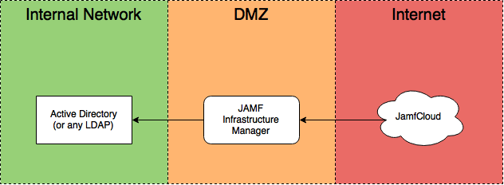
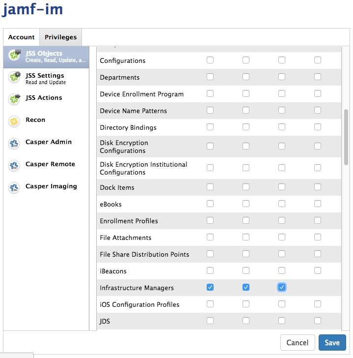
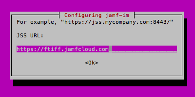
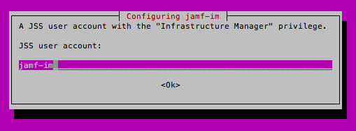
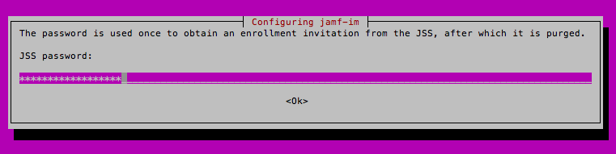
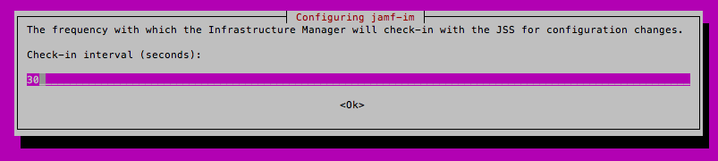
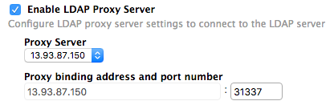

Infrastructure Manager
======================

Architecture
------------



Your JAMF Infrastructure Manager server should sit in the DMZ and should only be able to talk with the correct port of your LDAP server. 

It should be reachable from Internet at the port you'll specify in the JSS.

Prerequisites
-------------

Please read the `Administrator Manual <http://docs.jamfsoftware.com/9.97/casper-suite/administrator-guide/Infrastructure_Manager_Instances.html>`_ first.

Ubuntu 14.04 LTS
^^^^^^^^^^^^^^^^

You'll need to download and setup Ubuntu 14.04 LTS. I won't cover this here.

I use Microsoft Azure for test purposes.

Firewall settings
^^^^^^^^^^^^^^^^^

Internal Network <-> DMZ
""""""""""""""""""""""""

Infrastructure Manager Server should be able to reach:

- the LDAP server (389, 636 or 3268)
- your internal DNS server
- your internal NTP server if available

DMZ <-> Internet
""""""""""""""""

Infrastructure manager should be able to reach

- your JSS (port 8443 usually)

Infrastructure manager needs to be reached on the port you'll set later. Choose a port > 1024.

Consult `Permitting Inbound/Outbound Traffic with JAMF Cloud <https://jamfnation.jamfsoftware.com/article.html?id=409>`_ for more information. 

Java 1.8
^^^^^^^^^
In an ideal world, you should download Java from `Oracle <http://www.oracle.com/technetwork/java/javase/downloads/jdk8-downloads-2133151.html>`_. Or better, you shouldn't use Java. 

I found the best way to install Oracle Java 1.8 is doing the following:

.. code-block:: sh

    sudo add-apt-repository ppa:webupd8team/java
    sudo apt-get update
    sudo apt-get install oracle-java8-installer


You'll have to access Oracle's License to proceed.

As this is a third-party repository, use it with caution, and only on test instances. If you found a better way, please `contribute< <https://github.com/Shufflepuck/MacAdminsDoc/blob/master/00_About/Contributing.md>`_ 


Test with `java -version` to see if it works.

.. code-block:: sh

 $ java -version
 java version "1.8.0_101"
 Java(TM) SE Runtime Environment (build 1.8.0_101-b13)
 Java HotSpot(TM) 64-Bit Server VM (build 25.101-b13, mixed mode)

JAMF Infrastructure Manager package
^^^^^^^^^^^^^^^^^^^^^^^^^^^^^^^^^^^

1. Connect to JAMF Nation
2. Go to `My Assets <https://jamfnation.jamfsoftware.com/myAssets.html>`_
3. Download Infrastructure Manager
4. Upload it to your Linux server


I use ``scp`` to upload the binary to my server:

.. code-block:: sh

    cd ~/Downloads
    scp jamf-im_1.0.0-0_all.deb fti@13.93.87.150:

Configuring
-----------

Create the correct user in JSS
^^^^^^^^^^^^^^^^^^^^^^^^^^^^^^

Create a Standard User that has only "Infrastructure Manager" role.

.. image:: images/jamf-im-1.png


Launch the setup assistant
^^^^^^^^^^^^^^^^^^^^^^^^^^

By installing the package, you'll launch the setup assistant. 
``sudo dpkg -i jamf-im_1.0.0-0_all.deb``

Enter the host for your cloud instance:


Enter the login and password you created earlier:



Enter the public IP Address of your Infrastructure Manager server:
.. image:: images/jamf-im-sa-2.png

Setup the frequency. I use the default value of 30 seconds:


If everything goes well, you should see the following:
```
Enrollment invitation stored.
Successfully obtained enrollment invitation from https://ftiff.jamfcloud.com
```

Create a LDAP Server
^^^^^^^^^^^^^^^^^^^^

It's all downhill for now. Just kidding. This is the tricky part, as LDAP can be difficult to configure. We won't cover LDAP configuration here.

1. Open JSS
2. Go to System Settings > LDAP Servers
3. Add a LDAP Server
4. Choose "Configure Manually"
5. Choose "Enable LDAP Proxy Server"

Make sure you choose the right port number. It should be >1024 and be reachable from internet to your public IP address.




Troubleshooting
---------------

Log files
^^^^^^^^^
Log files are located here: 

- /var/log/jamf-im-launcher.log
- /var/log/jamf-im.log

LDAP Server needs authentication
^^^^^^^^^^^^^^^^^^^^^^^^^^^^^^^^

::

    Error: javax.naming.NamingException: [LDAP: error code 1 - 000004DC: LdapErr: DSID-0C0906E8, comment: In order to perform this operation a successful bind must be completed on the connection., data 0, v1db1]; remaining name 'OU=Org,DC=fti,DC=io'
    Suggestion: No suggestion available


Infrastructure Manager cannot bind to address
^^^^^^^^^^^^^^^^^^^^^^^^^^^^^^^^^^^^^^^^^^^^^

::

    2016-08-30 14:43:16,834 INFO c.j.j.l.LpsServerSocketListener [lps: /13.93.87.150:31337 (ssl)] Sleeping for 5000 ms before retry of server socket bind for address /13.93.87.150:31337
    2016-08-30 14:43:21,835 INFO c.j.j.l.LpsServerSocketListener [lps: /13.93.87.150:31337 (ssl)] Waking for retry of server socket bind for address /13.93.87.150:31337
    2016-08-30 14:43:21,839 ERROR c.j.j.l.LpsServerSocketListener [lps: /13.93.87.150:31337 (ssl)] Failed to obtain server socket for address /13.93.87.150:31337
    com.jamfsoftware.jsam.lps.LpsException: Failed to bind server socket to [/13.93.87.150:31337]
            at com.jamfsoftware.jsam.lps.socket.LpsSocketSupplier.bindServerSocket(LpsSocketSupplier.java:136) ~[11:ldap-proxy:0.0.1.20160714202842]
            at com.jamfsoftware.jsam.lps.socket.LpsSocketSupplier.createSslServerSocket(LpsSocketSupplier.java:61) ~[11:ldap-proxy:0.0.1.20160714202842]
            at com.jamfsoftware.jsam.lps.LpsServerSocketListener.safeCreateServerSocket(LpsServerSocketListener.java:150) [11:ldap-proxy:0.0.1.20160714202842]
            at com.jamfsoftware.jsam.lps.LpsServerSocketListener.bindServerSocket(LpsServerSocketListener.java:114) [11:ldap-proxy:0.0.1.20160714202842]
            at com.jamfsoftware.jsam.lps.LpsServerSocketListener.execute(LpsServerSocketListener.java:93) [11:ldap-proxy:0.0.1.20160714202842]
            at com.jamfsoftware.jsam.lps.LpsServerSocketListener.run(LpsServerSocketListener.java:72) [11:ldap-proxy:0.0.1.20160714202842]
    Caused by: java.net.BindException: Cannot assign requested address
            at java.net.PlainSocketImpl.socketBind(Native Method) ~[?:?]
            at java.net.AbstractPlainSocketImpl.bind(AbstractPlainSocketImpl.java:387) ~[?:?]
            at java.net.ServerSocket.bind(ServerSocket.java:375) ~[?:?]
            at java.net.ServerSocket.bind(ServerSocket.java:329) ~[?:?]
            at com.jamfsoftware.jsam.lps.socket.LpsSocketSupplier.bindServerSocket(LpsSocketSupplier.java:132) ~[?:?]
            ... 5 more
    2016-08-30 14:43:21,840 INFO c.j.j.l.LpsServerSocketListener [lps: /13.93.87.150:31337 (ssl)] Sleeping for 5000 ms before retry of server socket bind for address /13.93.87.150:31337


This error might happen if your server is not bound to a public address (if `ip show add` doesn't show the public address). This happens if you create a NAT to map a public IP address to a private IP.

I haven't found the solution for this one yet. It seems that JAMF haven't thought of this use case.