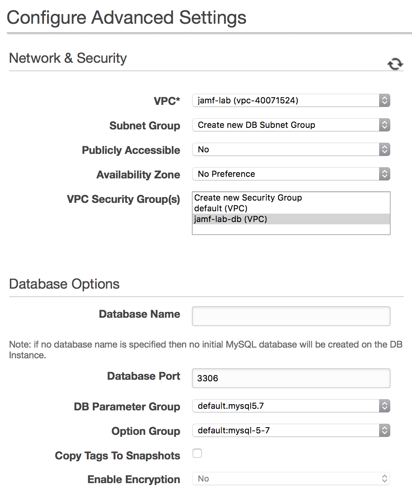

http://docs.jamf.com/9.98/casper-suite/jss-install-guide-linux/

# Introduction

## Prerequisites

# Configure AWS

## Configure Security

### Create VPC 

- Create VPC

### Create Subnets
- Create subnet on second Availability Zone 

### Create Security Groups
- jss-lab-jss: will reference my JSS instances
- jss-lab-jss-ports: Public ports (SSH and HTTPS/8443)
- jss-lab-db: MySQL from jss-lab


## Create RDS Instance

1. Choose MySQL (then Dev/Test MySQL)
2. DB Details 
3. Advanced Settings 

## Create EC2 Instance

1. RedHat 7
2. t2.micro (not recommended in production) 
3. Select storage 
4. Configure Security Group (SSH+HTTPS) 


# Install the JSS
## On EC2 Instance

Login to the EC2 Instance by using your newly created SSH key:

`ssh -i Jamf-EC2.pem ec2-user@ec2-34-251-175-48.eu-west-1.compute.amazonaws.com`

Let's update the instance!

`sudo yum update`

You may need to reboot (a good idea if kernel or firmware was upgraded!)

`sudo reboot`

Wait a few minutes until the instance is back online.

Upload the JSS Installer to the instance

`scp -i Jamf-EC2.pem ~/Downloads/JSSInstallerLinux9.98.zip ec2-user@ec2-34-251-175-48.eu-west-1.compute.amazonaws.com:`

Login to the EC2 Instance:

`ssh -i Jamf-EC2.pem ec2-34-251-175-48.eu-west-1.compute.amazonaws.com`


Install Java 1.8

`sudo yum install java-1.8.0-openjdk-devel`


Install unzip 

`sudo yum install unzip`

Unzip the JSS Installer

`unzip JSSInstallerLinux9.98.zip`

Launch the Installation Script

`sudo JSSInstallerLinux/JSS\ Installation/jssinstaller.run`

```
[ec2-user@ip-172-30-2-85 ~]$ sudo JSSInstallerLinux/JSS\ Installation/jssinstaller.run 
Verifying archive integrity... All good.
Uncompressing JSS Installer  100%  
Starting the Linux JSS Installation
Checking installation requirements...
Checking for a 64-bit OS...OK
Checking for Java 1.7+ ...Java minor version found: 8
Verifying JCE Unlimited Strength Jurisdiction Policy files...Found required JCE support on this server.
Java JCE files verified
Checking if Tomcat is NOT installed...OK
Passed all requirements

To be installed into /usr/local/jss:
* Tomcat 8.0.41
* JSS
* JSS Database Utility
*
* NOTE: When upgrading to Tomcat 8 for the first time, the account and group named 'tomcat7' will be renamed to 'jamftomcat'

Proceed?  (y/n): y
Installing...
Starting Tomcat Installation
Adding Tomcat user and group...


Installing init.d script...
Copying Tomcat files...
Setting permissions...
Tomcat Installation Done!
Starting JSS Installation
Generating Tomcat keystore...OK
Copying JSS Webapp...
jar command found
Creating the ROOT webapp directory for extraction point
Extracting ROOT.war using jar command
ROOT.war extracted successfully
Done extracting war...
Finalizing Tomcat and Web App settings...
JSS Webapp Installation Done!
Starting Database Backup Utility Installation
Copying JSS Database Backup Utility...Error: The JSS Database Utility must be launched on a system with MySQL installed.  If MySQL is already installed, you must specify the location of MySQL using the -mysqlPath flag.
JSS Database Utility 9.98
OK
JSS Database Backup Utility and backup script are located in /usr/local/jss/bin

The JSS has been installed.
Verify that port 8443 is not blocked by a firewall.

Note: MySQL is required for the JSS to run.  If you do not have MySQL installed, download and install the latest version.
MySQL Enterprise Edition is recommended and may be found at http://www.mysql.com/downloads/mysql
Alternatively, MySQL Community Edition may be installed:
Ubuntu/Debian users can run "apt-get install mysql-server"
RedHat users can run "yum install mysql-server"
Or any Linux distribution can download and install the appropriate package at http://www.mysql.com/downloads/mysql

To complete the installation, open a web browser and navigate to https://ip-172-30-2-85.eu-west-1.compute.internal:8443.
If you are installing the JSS for the first time, you are prompted with the JSS Setup Assistant. Complete the JSS Setup Assistant to start using your JSS.
[ec2-user@ip-172-30-2-85 ~]$ 
```

Done! 


## Configure RDS

When first connecting to your instance, you should get a "Database Connection Error"

Connect to your EC2 Instance.

First, install MySQL:

`sudo yum install mysql`

Create the `jamfsoftware` database

`mysql -h jamf-lab-db.c6kljkzma1b2.eu-west-1.rds.amazonaws.com -u jamfdbroot -p -e "CREATE DATABASE jamfsoftware"`

Create a new user `jamfsoftware` who will only connect from `10.0.0.248` and have access to all tables from `jamfsoftware` database, with password `changeme`

`mysql -h jamf-lab-db.c6kljkzma1b2.eu-west-1.rds.amazonaws.com -u jamfdbroot -p -e "GRANT ALL ON jamfsoftware.* TO jamfsoftware@10.0.0.248 IDENTIFIED BY 'changeme';"`

You can now go to https://ec2-34-251-175-48.eu-west-1.compute.amazonaws.com:8443/

Configure the DB with the database and credentials you entered above


And… Done!! You should now see the license!

# Redirecting from 8443 to 443

Install FirewallD

`sudo yum install firewalld`

Start the service

`sudo systemctl start firewalld`

Add the redirection

`sudo firewall-cmd --permanent --add-masquerade`
`sudo firewall-cmd --permanent --add-forward-port=port=443:proto=tcp:toport=8443`

Allow port 8443/TCP

`sudo firewall-cmd --permanent --add-port=8443/tcp`

Allow port 443/TCP

`sudo firewall-cmd --permanent --add-port=443/tcp`

Reload the service
`sudo firewall-cmd --reload`

Enable FirewallD at boot 

`sudo systemctl enable firewalld`

Why not reboot to test that everything is working fine!

`sudo reboot`

And that's done!

# Conclusion